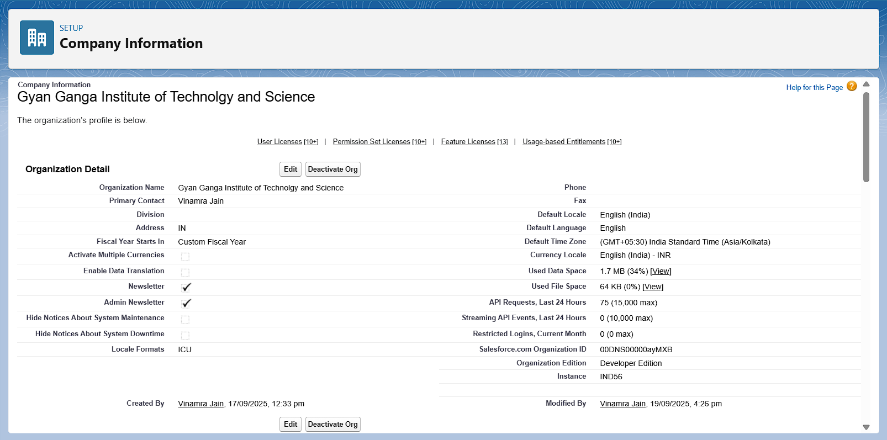

# CSBS Academic Management System - Project Documentation

Author: Vinamra Jain

---

## **Project Overview**

The CSBS Academic Management System is a specialized Customer Relationship Management (CRM) platform built on Salesforce, designed to streamline and manage the academic activities for 4th-year students of the Computer Science and Business Systems (CSBS) branch at GGITS. The system provides a centralized platform for faculty, students, and department heads (HODs) to manage core academic data, including student information, attendance records, marks, and official announcements. Key features include role-specific user interfaces, tools for efficient attendance and marks entry, a public-facing announcement board, and validation rules to ensure data integrity. The CRM addresses the critical business need for a unified, reliable, and accessible system to replace fragmented data management processes, thereby improving administrative efficiency and student engagement.

## **Objectives**

The primary objective of building this CRM is to create a single source of truth for all academic data related to the 4th-year CSBS students. The project aims to digitize and automate key academic processes to reduce manual effort and minimize human error. By providing role-based access and tailored user interfaces, the system intends to empower faculty with efficient tools for managing their daily tasks, while giving students direct, real-time access to their academic records. Ultimately, the CRM is designed to deliver significant business value by improving data accuracy, enhancing communication between faculty and students, and providing administrators with a comprehensive overview of academic operations, leading to better-informed decision-making.

---

## **Phase 1: Problem Understanding & Industry Analysis**

This initial phase involved a comprehensive analysis of the project requirements and the specific challenges within the educational sector.

- **Requirement Gathering:** The core requirement was to create a centralized system to manage student data, attendance, and marks. Interviews with notional stakeholders (faculty and students) identified key pain points, such as cumbersome spreadsheet-based record-keeping, lack of real-time data access for students, and difficulty in tracking attendance trends.
- **Stakeholder Analysis:** The primary stakeholders were identified as the Head of Department (HOD), Class Incharges, Faculty members, and Students. Each role has distinct needs: HODs require high-level oversight and reporting; faculty need efficient tools for data entry; and students require a simple interface to view their records and receive announcements.
- **Business Process Mapping:** The existing processes were mapped out. This revealed inefficiencies in how attendance was recorded daily, how marks were collated after exams, and how announcements were disseminated. The new system was designed to directly address these bottlenecks by automating notifications and centralizing data entry.
- **Industry-specific Use Case Analysis:** In the academic industry, student information systems (SIS) are crucial. This project adopts a "micro-SIS" approach, focusing on the most critical daily functions for a specific department rather than an entire university. Key use cases identified were "Daily Attendance Tracking," "Bulk Marks Entry Post-Examination," and "Urgent Announcement Broadcast."
- **AppExchange Exploration:** While various full-fledged educational apps exist on the AppExchange, developing a custom solution was deemed more appropriate for this project. This allows for a tailored data model and user experience that precisely fits the department's unique processes without the overhead and cost of a larger, more complex managed package.

---

## **Phase 2: Org Setup & Configuration**

This phase involved setting up the foundational elements of the Salesforce organization to support the academic management system.

### **2.1 Salesforce Editions**

- **Use Case:** The project required a full-featured Salesforce environment for development, testing, and customization without incurring licensing costs. The Salesforce Developer Edition was selected as it provides free access to all necessary features, including custom objects, process automation, Apex, Lightning Web Components, and API access, making it the ideal choice for building and demonstrating the application.
- **Screenshot:**
    
    
    
    Fig 2.1: SCREENSHOT OF THE COMPANY INFORMATION PAGE SHOWING "ORGANIZATION EDITION: DEVELOPER EDITION"
    

### **2.2 Company Profile Setup**

- **Use Case:** To brand the Salesforce org and set the default currency, language, and time zone to match the operational context of the institute. This ensures that all users have a consistent experience and that date/time fields align with the local time zone (IST).
- Configuration:
    
    
    | **Setting** | **Configuration** |
    | --- | --- |
    | Company Name | GGITS CSBS Academic Management System |
    | Default Currency | INR (₹) |
    | Default Language | English |
    | Default Time Zone | IST (Indian Standard Time) |
    | Default Locale | English (India) |
- **Screenshot:**
    
    
    
    Fig 2.2: SCREENSHOT OF THE COMPANY INFORMATION PAGE SHOWING THE CONFIGURED NAME, LOCALE, AND TIME ZONE
    

### **2.3 Business Hours & Holidays**

- **Use Case:** To define the standard working hours of the college. This information is foundational for future automation, such as case management or escalation rules, ensuring that automated processes only trigger during operational hours.
- Configuration:
    
    
    | **Field** | **Configuration** |
    | --- | --- |
    | Business Hours Name | College Hours |
    | Working Days | Monday - Saturday, 10:00 AM to 5:00 PM |
    | Holidays | TBD |
- **Screenshot:**
    
    
    
    Fig 2.3: SCREENSHOT OF THE "COLLEGE HOURS" BUSINESS HOURS SETUP PAGE
    

### **2.4 Fiscal Year Settings**

- **Use Case:** The standard Gregorian calendar (Jan-Dec) does not align with the academic year. A custom fiscal year was configured to run from July 1st to June 30th to ensure that all financial and academic reporting in Salesforce aligns perfectly with the institute's academic sessions.
- **Screenshot:**
    
    
    
    Fig 2.4: SCREENSHOT OF THE FISCAL YEAR SETUP PAGE SHOWING A CUSTOM FISCAL YEAR
    

### **2.5 User Setup & Licenses**

- **Use Case:** To create user accounts for all stakeholders and assign them the appropriate profiles and roles, ensuring they have the correct level of access from the moment they log in.
- Users:
    
    
    | **Full Name** | **Alias** | **Username** | **Role** | **Profile** |
    | --- | --- | --- | --- | --- |
    | Rituraj Ahluwalia | ahlur | [ahlu@ggits.org](mailto:ahlu@ggits.org) | HOD | System Administrator |
    | Siddharth Bhalerao | sidbha | [sbhal@ggits.org](mailto:sbhal@ggits.org) | Faculty | Faculty Profile |
    | Deepti Bhatia | dbhat | [dbhat@ggits.org](mailto:dbhat@ggits.org) | Faculty | Faculty Profile |
    | Vinamra Jain | VJain | [vinamra.jain.csbs22@brave-bear-noe056.com](mailto:vinamra.jain.csbs22@brave-bear-noe056.com) | HOD | System Administrator |
    | Shweta Tiwari | stiwa | [stiwa@ggits.org](mailto:stiwa@ggits.org) | Class Incharge | Class Incharge |
    | Santosh Vishwakarma | svishw | [svisw@ggits.org](mailto:svisw@ggits.org) | Faculty | Faculty Profile |
    | Sameer Yadav | syadav | [syada@ggits.org](mailto:syada@ggits.org) | Faculty | Faculty Profile |
- **Screenshot:**
    
    
    
    Fig 2.5: SCREENSHOT OF THE USERS LIST IN SETUP
    

### **2.6 Role Hierarchy**

- **Use Case:** To create a data access hierarchy that reflects the organizational structure of the department. This ensures that users in higher roles (like HOD) can view and access all the data owned by users below them (like Faculty and Students).
- **Structure:**
    
    ```
    Gyan Ganga Institute of Technology and Science
    │
    └── HOD
        │
        └── Class Incharge
            │
            └── Faculty
                │
                └── Student
    ```
    
- **Screenshot:**
    
    
    
    Fig 2.6: SCREENSHOT OF THE ROLE HIERARCHY SETUP PAGE
    

---

## **Phase 3: Data Modeling & Relationships**

This phase involved designing the custom data model to store all academic information.

### **3.1 Custom Objects**

Six custom objects were created to form the backbone of the application:

- Student (Student__c): Stores essential information about each student.
    
    
    | **Field Label** | **Field Name** | **Data Type** |
    | --- | --- | --- |
    | Student Name | Name | Text(80) |
    | Roll Number | Roll_Number__c | Text(12) |
    | Email | Email__c | Email |
    | Phone Number | Phone_Number__c | Phone |
    | Status | Status__c | Picklist |
- Faculty (Faculty__c): Stores information about each faculty member.
    
    
    | **Field Label** | **Field Name** | **Data Type** |
    | --- | --- | --- |
    | Faculty Name | Name | Text(80) |
    | Designation | Designation__c | Picklist |
    | Email | Email__c | Email |
    | Phone Number | Phone_Number__c | Phone |
    | Status | Status__c | Picklist |
    | Subjects Assigned | Subjects_Assigned__c | Picklist (Multi-Select) |
- Subject (Subject__c): Stores details about academic subjects.
    
    
    | **Field Label** | **Field Name** | **Data Type** |
    | --- | --- | --- |
    | Subject Name | Name | Text(80) |
    | Subject Code | Subject_Code__c | Text(6) |
- Attendance (Attendance__c): A junction object to track student attendance for a specific subject on a specific date.
    
    
    | **Field Label** | **Field Name** | **Data Type** |
    | --- | --- | --- |
    | ID | Name | Auto Number |
    | Student | Student__c | Master-Detail (Student) |
    | Subject | Subject__c | Master-Detail (Subject) |
    | Date | Date__c | Date |
    | Status | Status__c | Picklist |
    | Notes | Notes__c | Text Area (255) |
- Marks (Marks__c): Stores the marks obtained by a student in a subject for a specific exam.
    
    
    | **Field Label** | **Field Name** | **Data Type** |
    | --- | --- | --- |
    | Marks ID | Name | Auto Number |
    | Student | Student__c | Master-Detail (Student) |
    | Subject | Subject__c | Lookup (Subject) |
    | Exam Type | Exam_Type__c | Picklist |
    | Marks Obtained | Marks_Obtained__c | Number (5, 0) |
    | Maximum Marks | Maximum_Marks__c | Formula (Number) |
- Announcement (Announcement__c): Stores academic or general announcements posted by faculty.
    
    
    | **Field Label** | **Field Name** | **Data Type** |
    | --- | --- | --- |
    | Announcement Title | Name | Text(80) |
    | Posted By | Posted_By__c | Lookup (Faculty) |
    | Description | Description__c | Long Text Area (32768) |
    | Date | Date__c | Formula (Date) |
    | Type | Type__c | Picklist |

### **3.2 Schema Builder**

- **Use Case:** The Schema Builder was used to visualize the data model, including all objects and their relationships (Master-Detail, Lookup). This provided a clear architectural overview and helped confirm the relationships were correctly configured.
- **Screenshot:**
    
    
    
    Fig 3.1: SCREENSHOT OF THE SCHEMA BUILDER SHOWING THE SIX CUSTOM OBJECTS AND THEIR RELATIONSHIP LINES
    

### **3.3 Page Layouts**

- **Use Case:** To provide different user profiles with a tailored view of record data. For each of the six custom objects, three distinct page layouts were created (Admin, Student, Faculty) to show or hide fields and sections based on the user's role.
- **Screenshot:**
    
    
    
    Fig 3.2: SCREENSHOT OF THE PAGE LAYOUT ASSIGNMENT PAGE FOR THE STUDENT OBJECT
    

### **3.4 Compact Layouts**

- **Use Case:** The "System Default" compact layout was used for all custom objects. This ensures that a consistent and concise summary of key fields appears in the highlights panel on a record page and when a record is looked up in the Salesforce mobile app.
- **Screenshot:**
    
    
    
    Fig 3.3: SCREENSHOT OF THE COMPACT LAYOUT LIST FOR THE ANNOUNCEMENT OBJECT
    

---

## **Phase 4: Process Automation (Admin)**

This phase focuses on the automation implemented to enforce business logic and streamline processes.

### **4.1 Validation Rules**

- **Use Case:** To ensure data integrity and accuracy at the point of entry. These rules prevent invalid data such as future attendance dates, negative marks, and incomplete records.
- **Implemented Rules:**
    - **Announcement:**
        - `Posted_By_Required`: Ensures an announcement is linked to a faculty member.
        - `Title_Required`: Makes the announcement title mandatory.
        - `Type_Required`: Requires a type to be selected.
    - **Faculty:**
        - `Faculty_Email_Valid`: Checks for a valid faculty email address.
        - `Faculty_Phone_Valid`: Ensures the phone number contains exactly 10 digits.
        - `Faculty_Status_Required`: Makes the faculty status field mandatory.
    - **Marks:**
        - `Exam_Type_Required`: Requires an exam type to be selected.
        - `Marks_NonNegative`: Prevents marks from being a negative number.
        - `Marks_Within_Limit`: Ensures marks obtained do not exceed maximum marks.
        - `Subject_Link_Required`: Makes linking to a subject mandatory.
    - **Attendance:**
        - `Date_Not_Future`: Prevents the attendance date from being in the future.
        - `Date_Required`: Makes the attendance date a required field.
        - `Status_Required`: Requires an attendance status (e.g., Present, Absent) to be selected.
- **Screenshot:**
    
    
    
    Fig 4.1: SCREENSHOT OF THE VALIDATION RULES LIST FOR THE MARKS OBJECT
    

### **4.2 Future Scope & Enhancements**

While the current implementation focuses on data validation, the following process automation features are identified as high-value future enhancements:

- **Low Attendance Alerts (Record-Triggered Flow):** Automatically email a student and their Class Incharge when their attendance in a subject drops below 75%.
- **Exam Results Notification (Record-Triggered Flow):** Automatically send a custom notification or email to a student when their final exam marks are entered.
- **New Announcement Broadcast (Record-Triggered Flow):** When a new announcement is created, automatically email it to all relevant students.
- **Leave of Absence Approval (Approval Process):** Implement a formal, multi-step approval process for student leave requests, routing from Class Incharge to HOD.

---

## **Phase 5: Apex Programming (Developer)**

This phase covers the custom server-side logic developed in Apex to support the application's complex user interface requirements.

### **5.1 `AttendanceController.cls`**

- **Use Case:** This class is the primary back-end controller for the `attendanceTracker` LWC. It handles fetching students, loading existing attendance data for a specific day, and saving all attendance records in a single transaction.
- **Key Concepts:** Wrapper Classes, SOQL, Aggregate SOQL for history, DML (`upsert`), JSON Deserialization.
- **Code:**
    
    ```java
    public with sharing class AttendanceController {
    
        // Wrapper updated to use a String for status
        public class AttendanceWrapper {
            @AuraEnabled public Id studentId { get; set; }
            @AuraEnabled public String studentName { get; set; }
            @AuraEnabled public String rollNumber { get; set; }
            @AuraEnabled public String status { get; set; } // Changed from isPresent
            @AuraEnabled public Id attendanceId { get; set; }
            @AuraEnabled public Date attendanceDate { get; set; }
            @AuraEnabled public Id subjectId { get; set; }
        }
    
        public class HistoryWrapper {
            @AuraEnabled public Date attendanceDate { get; set; }
            @AuraEnabled public Integer presentCount { get; set; }
            @AuraEnabled public Integer absentCount { get; set; }
        }
    
        /**
        * @description Gets the picklist values for the Status field on the Attendance object.
        * @return List<Map<String, String>> A list of label-value pairs for the picklist.
        */
        @AuraEnabled(cacheable=true)
        public static List<Map<String, String>> getAttendanceStatusOptions() {
            List<Map<String, String>> options = new List<Map<String, String>>();
            Schema.DescribeFieldResult fieldResult = Attendance__c.Status__c.getDescribe();
            List<Schema.PicklistEntry> ple = fieldResult.getPicklistValues();
            for (Schema.PicklistEntry p : ple) {
                options.add(new Map<String, String>{'label' => p.getLabel(), 'value' => p.getValue()});
            }
            return options;
        }
    
        @AuraEnabled(cacheable=true)
        public static List<AttendanceWrapper> getStudentsForAttendance(Date selectedDate, Id subjectId) {
            if (subjectId == null || selectedDate == null) {
                throw new AuraHandledException('Subject and Date are required.');
            }
    
            Map<Id, AttendanceWrapper> studentWrapperMap = new Map<Id, AttendanceWrapper>();
    
            for (Student__c student : [SELECT Id, Name, Roll_Number__c FROM Student__c ORDER BY Roll_Number__c]) {
                AttendanceWrapper wrapper = new AttendanceWrapper();
                wrapper.studentId = student.Id;
                wrapper.studentName = student.Name;
                wrapper.rollNumber = student.Roll_Number__c;
                wrapper.status = 'Absent'; // Default status
                studentWrapperMap.put(student.Id, wrapper);
            }
    
            for (Attendance__c att : [
                SELECT Id, Status__c, Student__c FROM Attendance__c
                WHERE Date__c = :selectedDate AND Subject__c = :subjectId AND Student__c IN :studentWrapperMap.keySet()
            ]) {
                if (studentWrapperMap.containsKey(att.Student__c)) {
                    AttendanceWrapper wrapper = studentWrapperMap.get(att.Student__c);
                    wrapper.attendanceId = att.Id;
                    wrapper.status = att.Status__c;
                }
            }
            return studentWrapperMap.values();
        }
    
        @AuraEnabled
        public static String saveAttendance(String attendanceDataJSON) {
            try {
                List<AttendanceWrapper> wrappers = (List<AttendanceWrapper>) JSON.deserialize(attendanceDataJSON, List<AttendanceWrapper>.class);
                List<Attendance__c> recordsToUpsert = new List<Attendance__c>();
    
                for (AttendanceWrapper wrap : wrappers) {
                    Attendance__c att = new Attendance__c();
                    if (wrap.attendanceId != null) {
                        att.Id = wrap.attendanceId;
                    }
                    att.Student__c = wrap.studentId;
                    att.Subject__c = wrap.subjectId;
                    att.Date__c = wrap.attendanceDate;
                    att.Status__c = wrap.status; // Directly use the status string
                    recordsToUpsert.add(att);
                }
    
                if (!recordsToUpsert.isEmpty()) {
                    upsert recordsToUpsert;
                }
                return 'Success';
            } catch (Exception e) {
                throw new AuraHandledException(e.getMessage());
            }
        }
    
        // getSubjects() and getAttendanceHistory() methods remain unchanged...
        @AuraEnabled(cacheable=true)
        public static List<Subject__c> getSubjects() {
            return [SELECT Id, Name FROM Subject__c ORDER BY Name];
        }
    
        @AuraEnabled(cacheable=true)
        public static List<HistoryWrapper> getAttendanceHistory(Id subjectId) {
            if(subjectId == null) { return new List<HistoryWrapper>(); }
            Map<Date, HistoryWrapper> historyMap = new Map<Date, HistoryWrapper>();
            for(AggregateResult ar : [
                SELECT Date__c dt, Status__c st, COUNT(Id) c FROM Attendance__c
                WHERE Subject__c = :subjectId GROUP BY Date__c, Status__c ORDER BY Date__c DESC LIMIT 50
            ]) {
                Date attendanceDate = (Date)ar.get('dt');
                String status = (String)ar.get('st');
                Integer count = (Integer)ar.get('c');
                HistoryWrapper hw = historyMap.get(attendanceDate);
                if (hw == null) {
                    hw = new HistoryWrapper();
                    hw.attendanceDate = attendanceDate;
                    hw.presentCount = 0;
                    hw.absentCount = 0;
                    historyMap.put(attendanceDate, hw);
                }
                if (status == 'Present') { hw.presentCount = count; }
                else if (status == 'Absent') { hw.absentCount = count; }
            }
            return historyMap.values();
        }
    }
    
    ```
    

### **5.2 `MarksController.cls`**

- **Use Case:** This class supports the `marksTracker` LWC. It provides methods for faculty to load a list of students for a specific exam and save their marks, and a separate method for students to view their own marks.
- **Key Concepts:** Formula Field Evaluation (`Formula.recalculateFormulas`), User Context (`UserInfo.getUserEmail()`), JSON Deserialization.
- **Code:**
    
    ```java
    public with sharing class MarksController {
    
        public class MarksEntryWrapper {
            @AuraEnabled public Id studentId { get; set; }
            @AuraEnabled public String studentName { get; set; }
            @AuraEnabled public String rollNumber { get; set; }
            @AuraEnabled public Decimal marksObtained { get; set; }
            @AuraEnabled public Decimal maximumMarks { get; set; }
            @AuraEnabled public Id markId { get; set; }
            @AuraEnabled public List<Marks__c> recentMarks { get; set; }
        }
    
        @AuraEnabled(cacheable=true)
        public static List<Subject__c> getSubjects() {
            return [SELECT Id, Name FROM Subject__c ORDER BY Name];
        }
    
        @AuraEnabled(cacheable=true)
        public static List<Map<String, String>> getExamTypes() {
            List<Map<String, String>> options = new List<Map<String, String>>();
            Schema.DescribeFieldResult fieldResult = Marks__c.Exam_Type__c.getDescribe();
            for (Schema.PicklistEntry p : fieldResult.getPicklistValues()) {
                options.add(new Map<String, String>{'label' => p.getLabel(), 'value' => p.getValue()});
            }
            return options;
        }
    
        @AuraEnabled(cacheable=true)
        public static List<MarksEntryWrapper> getStudentsForMarksEntry(Id subjectId, String examType) {
            if (subjectId == null || String.isBlank(examType)) {
                throw new AuraHandledException('Subject and Exam Type are required.');
            }
    
            // --- THIS SECTION IS NOW UPDATED ---
            Marks__c dummyRecord = new Marks__c(Exam_Type__c = examType);
            // Use the new, recommended method for recalculating formulas
            Formula.recalculateFormulas(new List<Marks__c>{dummyRecord});
            Decimal maxMarksForExam = dummyRecord.Maximum_Marks__c;
            // --- END UPDATE ---
    
            Map<Id, MarksEntryWrapper> studentWrapperMap = new Map<Id, MarksEntryWrapper>();
            List<Student__c> allStudents = [SELECT Id, Name, Roll_Number__c FROM Student__c ORDER BY Roll_Number__c];
    
            for (Student__c student : allStudents) {
                MarksEntryWrapper wrapper = new MarksEntryWrapper();
                wrapper.studentId = student.Id;
                wrapper.studentName = student.Name;
                wrapper.rollNumber = student.Roll_Number__c;
                wrapper.maximumMarks = maxMarksForExam;
                wrapper.recentMarks = new List<Marks__c>();
                studentWrapperMap.put(student.Id, wrapper);
            }
    
            for (Marks__c mark : [
                SELECT Id, Marks_Obtained__c, Student__c
                FROM Marks__c
                WHERE Subject__c = :subjectId AND Exam_Type__c = :examType AND Student__c IN :studentWrapperMap.keySet()
            ]) {
                MarksEntryWrapper wrapper = studentWrapperMap.get(mark.Student__c);
                wrapper.marksObtained = mark.Marks_Obtained__c;
                wrapper.markId = mark.Id;
            }
    
            for (Marks__c recentMark : [
                SELECT Id, Exam_Type__c, Marks_Obtained__c, Maximum_Marks__c, Student__c
                FROM Marks__c
                WHERE Subject__c = :subjectId AND Exam_Type__c != :examType AND Student__c IN :studentWrapperMap.keySet()
                ORDER BY CreatedDate DESC
                LIMIT 250
            ]) {
                MarksEntryWrapper wrapper = studentWrapperMap.get(recentMark.Student__c);
                if (wrapper.recentMarks.size() < 5) {
                    wrapper.recentMarks.add(recentMark);
                }
            }
            return studentWrapperMap.values();
        }
    
        @AuraEnabled(cacheable=true)
        public static List<Marks__c> getStudentMarks() {
            String currentUserEmail = UserInfo.getUserEmail();
            List<Student__c> students = [SELECT Id FROM Student__c WHERE Email__c = :currentUserEmail LIMIT 1];
            if (students.isEmpty()) { return new List<Marks__c>(); }
            Id studentId = students[0].Id;
            return [
                SELECT Id, Subject__r.Name, Exam_Type__c, Marks_Obtained__c, Maximum_Marks__c
                FROM Marks__c WHERE Student__c = :studentId ORDER BY CreatedDate DESC
            ];
        }
    
        @AuraEnabled
        public static String saveMarks(String marksDataJSON) {
            try {
                List<Marks__c> marksToUpsert = (List<Marks__c>) JSON.deserialize(marksDataJSON, List<Marks__c>.class);
                if (!marksToUpsert.isEmpty()) {
                    upsert marksToUpsert;
                }
                return 'Success';
            } catch (Exception e) {
                throw new AuraHandledException(e.getMessage());
            }
        }
    }
    
    ```
    

### **5.3 `AnnouncementMakerController.cls`**

- **Use Case:** This class serves the `announcementMaker` LWC, providing faculty-specific functionality. It allows authenticated faculty users to create new announcements and view a list of their own recent posts.
- **Key Concepts:** User Context (`UserInfo.getUserEmail()`), DML (`insert`), Dynamic Picklist Values.
- **Code:**
    
    ```java
    public with sharing class AnnouncementMakerController {
    
        // Helper class for returning picklist values
        public class PicklistOption {
            @AuraEnabled public String label { get; set; }
            @AuraEnabled public String value { get; set; }
            public PicklistOption(String label, String value) {
                this.label = label;
                this.value = value;
            }
        }
    
        // CORRECTED: This method now finds the Faculty record by matching the user's email.
        private static Id getCurrentFacultyId() {
            String currentUserEmail = UserInfo.getUserEmail();
            Faculty__c[] facultyMembers = [SELECT Id FROM Faculty__c WHERE Email__c = :currentUserEmail LIMIT 1];
    
            if (facultyMembers.isEmpty()) {
                throw new AuraHandledException('Could not find a Faculty record with an email matching the current user.');
            }
            return facultyMembers[0].Id;
        }
    
        @AuraEnabled(cacheable=true)
        public static List<Announcement__c> getFacultyAnnouncements() {
            Id facultyId = getCurrentFacultyId();
            return [
                SELECT Name, Description__c, Date__c, Type__c
                FROM Announcement__c
                WHERE Posted_By__c = :facultyId
                ORDER BY CreatedDate DESC
                LIMIT 5
            ];
        }
    
        @AuraEnabled(cacheable=true)
        public static List<PicklistOption> getAnnouncementTypes() {
            List<PicklistOption> options = new List<PicklistOption>();
            Schema.DescribeFieldResult fieldResult = Announcement__c.Type__c.getDescribe();
            for (Schema.PicklistEntry entry : fieldResult.getPicklistValues()) {
                options.add(new PicklistOption(entry.getLabel(), entry.getValue()));
            }
            return options;
        }
    
        @AuraEnabled
        public static Announcement__c createAnnouncement(String title, String description, String type) {
            if (String.isBlank(title) || String.isBlank(description)) {
                throw new AuraHandledException('Title and Description are required.');
            }
    
            Id facultyId = getCurrentFacultyId();
    
            Announcement__c newAnnouncement = new Announcement__c(
                Name = title,
                Description__c = description,
                Type__c = type,
                Posted_By__c = facultyId
            );
    
            insert newAnnouncement;
            return newAnnouncement;
        }
    }
    
    ```
    

### **5.4 `GuestUserDataController.cls`**

- **Use Case:** This is a critical architectural component. It consolidates all **read-only** Apex methods that need to be accessed by guest users on the public Student Portal. This approach simplifies the security model by providing a single, secure entry point for all public data queries.
- **Key Concepts:** Architectural Pattern for Guest Users, Dynamic SOQL, Code Consolidation, Security.
- **Code:**
    
    ```java
    /**
    * @description Provides all read-only data for guest-facing LWC components.
    * Access for guest users is controlled by the site's Guest User Profile.
    */
    public with sharing class GuestUserDataController {
    
        // Helper class for returning picklist values to LWC
        public class PicklistOption {
            @AuraEnabled public String label { get; set; }
            @AuraEnabled public String value { get; set; }
            public PicklistOption(String label, String value) {
                this.label = label;
                this.value = value;
            }
        }
    
        // =================================================================
        // == Methods for Announcement Board LWC
        // =================================================================
        @AuraEnabled(cacheable=true)
        public static List<Announcement__c> getAnnouncements() {
            return [
                SELECT Id, Name, Description__c, Date__c, Type__c, Posted_By__r.Name
                FROM Announcement__c
                ORDER BY CreatedDate DESC
                LIMIT 50
            ];
        }
    
        // =================================================================
        // == Methods for Attendance View (Read-Only) LWC
        // =================================================================
        @AuraEnabled(cacheable=false)
        public static List<Attendance__c> getAttendanceRecords(Date filterDate, Id subjectId) {
            String query = 'SELECT Id, Name, Date__c, Status__c, Student__r.Name, Subject__r.Name FROM Attendance__c';
            List<String> whereClauses = new List<String>();
    
            if (filterDate != null) {
                whereClauses.add('Date__c = :filterDate');
            }
            if (subjectId != null) {
                whereClauses.add('Subject__c = :subjectId');
            }
    
            if (!whereClauses.isEmpty()) {
                query += ' WHERE ' + String.join(whereClauses, ' AND ');
            }
            query += ' ORDER BY Date__c DESC, CreatedDate DESC LIMIT 200';
            return Database.query(query);
        }
    
        // =================================================================
        // == Methods for Marks View (Read-Only) LWC
        // =================================================================
        @AuraEnabled(cacheable=false)
        public static List<Marks__c> getMarksBySubjectAndExam(Id subjectId, String examType) {
            if (subjectId == null) {
                return new List<Marks__c>();
            }
            String query = 'SELECT Student__r.Name, Student__r.Roll_Number__c, Marks_Obtained__c, Maximum_Marks__c, Exam_Type__c FROM Marks__c';
            List<String> whereClauses = new List<String>();
            whereClauses.add('Subject__c = :subjectId');
    
            if (String.isNotBlank(examType)) {
                whereClauses.add('Exam_Type__c = :examType');
            }
    
            query += ' WHERE ' + String.join(whereClauses, ' AND ');
            query += ' ORDER BY Student__r.Name';
            return Database.query(query);
        }
    
        // =================================================================
        // == Shared Helper Methods for Filters
        // =================================================================
        @AuraEnabled(cacheable=true)
        public static List<Subject__c> getSubjects() {
            return [SELECT Id, Name FROM Subject__c ORDER BY Name];
        }
    
        @AuraEnabled(cacheable=true)
        public static List<PicklistOption> getExamTypes() {
            List<PicklistOption> options = new List<PicklistOption>();
            Schema.DescribeFieldResult fieldResult = Marks__c.Exam_Type__c.getDescribe();
            for (Schema.PicklistEntry entry : fieldResult.getPicklistValues()) {
                options.add(new PicklistOption(entry.getLabel(), entry.getValue()));
            }
            return options;
        }
    }
    
    ```
    

*(Note: Other controllers like `AnnouncementController`, `MarksViewController`, etc., were refactored or consolidated into the controllers listed above during development.)*

---

## **Phase 6: User Interface Development**

This phase covers the development of the front-end Lightning Web Components (LWCs) that form the user interface of the application.

### **6.1 LWC: `announcementBoard`**

- **Use Case:** A read-only component to display a list of the most recent campus announcements. It is designed for public-facing pages like the Student Portal home page.
- **Apex Controller:** `GuestUserDataController.getAnnouncements`
- **Code:**
    - **HTML:**
        
        ```html
        <template>
            <lightning-card title="Campus Announcement Board" icon-name="standard:feed">
                <div class="slds-p-around_medium">
                    <template if:true={isLoading}>
                        <div class="slds-is-relative slds-m-vertical_large">
                            <lightning-spinner alternative-text="Loading Announcements..." variant="brand"></lightning-spinner>
                        </div>
                    </template>
        
                    <template for:each={announcements} for:item="ann">
                        <article key={ann.Id} class="slds-post slds-box slds-m-bottom_medium">
                            <header class="slds-post__header slds-media">
                                <div class="slds-media__figure">
                                    <lightning-icon icon-name="standard:announcement" size="small"></lightning-icon>
                                </div>
                                <div class="slds-media__body">
                                    <div class="slds-grid slds-grid_align-spread slds-has-flexi-truncate">
                                        <p>
                                            Posted By: <strong>{ann.FacultyName}</strong>
                                        </p>
                                        <p class="slds-text-body_small">
                                            <lightning-formatted-date-time
                                                value={ann.Date__c}
                                                year="numeric"
                                                month="short"
                                                day="2-digit">
                                            </lightning-formatted-date-time>
                                        </p>
                                    </div>
                                </div>
                            </header>
        
                            <div class="slds-post__content slds-text-longform slds-m-top_medium">
                                <h3 class="slds-text-heading_medium slds-m-bottom_small">{ann.Name}</h3>
                                <lightning-formatted-rich-text value={ann.Description__c}></lightning-formatted-rich-text>
                            </div>
        
                            <footer class="slds-post__footer slds-m-top_medium">
                                <lightning-badge label={ann.Type__c}></lightning-badge>
                            </footer>
                        </article>
                    </template>
        
                    <template if:true={noAnnouncements}>
                            <div class="slds-align_absolute-center slds-p-around_large">
                                <p>There are no recent announcements.</p>
                            </div>
                    </template>
                </div>
            </lightning-card>
        </template>
        
        ```
        
    - **JavaScript:**
        
        ```jsx
        import { LightningElement, wire } from 'lwc';
        // UPDATED: Points to the new controller
        import getAnnouncements from '@salesforce/apex/GuestUserDataController.getAnnouncements';
        
        export default class AnnouncementBoard extends LightningElement {
            announcements = [];
            error;
            isLoading = true;
        
            @wire(getAnnouncements)
            wiredAnnouncements({ error, data }) {
                if (data) {
                    // "Flatten" the data to make it easier to access in the template
                    this.announcements = data.map(record => {
                        // Check if the related Faculty record and Name exist
                        const facultyName = record.Posted_By__r ? record.Posted_By__r.Name : 'N/A';
                        return {
                            ...record,
                            FacultyName: facultyName
                        };
                    });
                    this.error = undefined;
                } else if (error) {
                    this.error = error;
                    this.announcements = [];
                    console.error('Error loading announcements:', error);
                }
                this.isLoading = false;
            }
        
            // Getter to easily check if there are no announcements to show
            get noAnnouncements() {
                return !this.isLoading && this.announcements.length === 0;
            }
        }
        
        ```
        
    - **XML:**
        
        ```xml
        <?xml version="1.0" encoding="UTF-8"?>
        <LightningComponentBundle xmlns="[http://soap.sforce.com/2006/04/metadata](http://soap.sforce.com/2006/04/metadata)">
            <apiVersion>59.0</apiVersion>
            <isExposed>true</isExposed>
            <masterLabel>Announcement Board</masterLabel>
            <targets>
                <target>lightningCommunity__Page</target>
                <target>lightningCommunity__Default</target>
                <target>lightning__AppPage</target>
            </targets>
        </LightningComponentBundle>
        
        ```
        

### **6.2 LWC: `announcementMaker`**

- **Use Case:** A dual-function dashboard for faculty to create new announcements and simultaneously view their own five most recent posts. Intended for the Faculty Portal.
- **Apex Controller:** `AnnouncementMakerController`
- **Code:**
    - **HTML:**
        
        ```html
        <template>
            <lightning-card title="Faculty Announcement Dashboard" icon-name="standard:announcement">
                <div class="slds-p-around_medium">
                    <lightning-layout multiple-rows="true">
        
                        <lightning-layout-item size="12" medium-device-size="5" padding="around_medium">
                            <h2 class="slds-text-heading_medium slds-m-bottom_medium">Create New Announcement</h2>
        
                            <lightning-combobox
                                name="type"
                                label="Announcement Type"
                                value={typeValue}
                                options={typeOptions}
                                onchange={handleInputChange}
                                class="slds-m-bottom_small"
                                required>
                            </lightning-combobox>
        
                            <lightning-input
                                name="title"
                                label="Announcement Title"
                                value={titleValue}
                                onchange={handleInputChange}
                                class="slds-m-bottom_small"
                                required>
                            </lightning-input>
        
                            <lightning-input-rich-text
                                label="Message"
                                name="description"
                                value={descriptionValue}
                                onchange={handleInputChange}
                                message-when-value-missing="Message is required.">
                            </lightning-input-rich-text>
        
                            <lightning-button
                                label="Post Announcement"
                                variant="brand"
                                onclick={handlePostClick}
                                disabled={isLoading}
                                class="slds-m-top_medium slds-float_right">
                            </lightning-button>
                        </lightning-layout-item>
        
                        <lightning-layout-item size="12" medium-device-size="7" padding="around_medium">
                            <h2 class="slds-text-heading_medium slds-m-bottom_medium">Your 5 Most Recent Announcements</h2>
        
                            <template if:true={isLoading}>
                                <lightning-spinner alternative-text="Loading..."></lightning-spinner>
                            </template>
        
                            <template if:false={isLoading}>
                                <template for:each={recentAnnouncements} for:item="ann">
                                    <div key={ann.Id} class="slds-box slds-m-bottom_small">
                                        <p class="slds-text-body_small">
                                            <lightning-formatted-date-time value={ann.Date__c} year="numeric" month="short" day="2-digit"></lightning-formatted-date-time>
                                            <lightning-badge label={ann.Type__c} class="slds-m-left_small"></lightning-badge>
                                        </p>
                                        <p class="slds-text-heading_small slds-m-vertical_x-small">{ann.Name}</p>
                                        <lightning-formatted-rich-text value={ann.Description__c}></lightning-formatted-rich-text>
                                    </div>
                                </template>
                                <template if:true={noAnnouncements}>
                                    <p>You have not posted any announcements yet.</p>
                                </template>
                            </template>
                        </lightning-layout-item>
                    </lightning-layout>
                </div>
            </lightning-card>
        </template>
        
        ```
        
    - **JavaScript:**
        
        ```jsx
        import { LightningElement, wire } from 'lwc';
        import { ShowToastEvent } from 'lightning/platformShowToastEvent';
        import { refreshApex } from '@salesforce/apex';
        import getFacultyAnnouncements from '@salesforce/apex/AnnouncementMakerController.getFacultyAnnouncements';
        import getAnnouncementTypes from '@salesforce/apex/AnnouncementMakerController.getAnnouncementTypes';
        import createAnnouncement from '@salesforce/apex/AnnouncementMakerController.createAnnouncement';
        
        export default class AnnouncementMaker extends LightningElement {
            // Form properties
            titleValue = '';
            descriptionValue = '';
            typeValue = '';
            typeOptions = [];
        
            // Display properties
            recentAnnouncements = [];
            wiredAnnouncementsResult; // Property to hold the wired result for refreshApex
            isLoading = false;
        
            @wire(getFacultyAnnouncements)
            wiredAnnouncements(result) {
                this.wiredAnnouncementsResult = result;
                if (result.data) {
                    this.recentAnnouncements = result.data;
                } else if (result.error) {
                    this.showToast('Error', 'Could not load recent announcements.', 'error');
                }
            }
        
            @wire(getAnnouncementTypes)
            wiredTypes({ error, data }) {
                if (data) {
                    this.typeOptions = data;
                    // Set a default value if available
                    if (data.length > 0) {
                        this.typeValue = data[0].value;
                    }
                }
            }
        
            handleInputChange(event) {
                const field = event.target.name;
                if (field === 'title') {
                    this.titleValue = event.target.value;
                } else if (field === 'description') {
                    this.descriptionValue = event.target.value;
                } else if (field === 'type') {
                    this.typeValue = event.detail.value;
                }
            }
        
            handlePostClick() {
                if (!this.validateInput()) {
                    this.showToast('Incomplete', 'Please fill out all required fields.', 'warning');
                    return;
                }
        
                this.isLoading = true;
                createAnnouncement({
                    title: this.titleValue,
                    description: this.descriptionValue,
                    type: this.typeValue
                })
                .then(() => {
                    this.showToast('Success', 'Your announcement has been posted!', 'success');
                    this.resetForm();
                    // Refresh the list of recent announcements
                    return refreshApex(this.wiredAnnouncementsResult);
                })
                .catch(error => {
                    this.showToast('Error', error.body.message, 'error');
                })
                .finally(() => {
                    this.isLoading = false;
                });
            }
        
            validateInput() {
                return this.titleValue && this.descriptionValue && this.typeValue;
            }
        
            resetForm() {
                this.titleValue = '';
                this.descriptionValue = '';
            }
        
            get noAnnouncements() {
                return this.recentAnnouncements.length === 0;
            }
        
            showToast(title, message, variant) {
                this.dispatchEvent(new ShowToastEvent({ title, message, variant }));
            }
        }
        
        ```
        
    - **XML:**
        
        ```xml
        <?xml version="1.0" encoding="UTF-8"?>
        <LightningComponentBundle xmlns="[http://soap.sforce.com/2006/04/metadata](http://soap.sforce.com/2006/04/metadata)">
            <apiVersion>59.0</apiVersion>
            <isExposed>true</isExposed>
            <masterLabel>Faculty Announcement Maker</masterLabel>
            <targets>
                <target>lightningCommunity__Page</target>
                <target>lightningCommunity__Default</target>
                <target>lightning__AppPage</target>
                <target>lightning__HomePage</target>
            </targets>
        </LightningComponentBundle>
        
        ```
        

### **6.3 LWC: `attendanceTracker`**

- **Use Case:** A feature-rich, interactive interface for faculty to take daily student attendance. It features a modern "tile" based UI for quick status toggling and provides real-time summary counts.
- **Apex Controller:** `AttendanceController`
- **Code:**
    - **HTML:**
        
        ```html
        <template>
            <lightning-card title="Attendance Tracker" icon-name="standard:event">
                <div class="slds-p-around_medium">
                    <template if:true={isLoading}>
                        <lightning-spinner alternative-text="Loading..." size="medium"></lightning-spinner>
                    </template>
                    <lightning-layout multiple-rows="true" pull-to-boundary="small">
                        <lightning-layout-item size="12" small-device-size="12" medium-device-size="4" padding="around-small">
                            <lightning-input type="date" label="Select Date" value={selectedDate} onchange={handleDateChange} required></lightning-input>
                        </lightning-layout-item>
                        <lightning-layout-item size="12" small-device-size="12" medium-device-size="6" padding="around-small">
                            <lightning-combobox name="subject" label="Select Subject" value={selectedSubject} placeholder="-- Select a Subject --" options={subjectOptions} onchange={handleSubjectChange} required></lightning-combobox>
                        </lightning-layout-item>
                        <lightning-layout-item size="12" small-device-size="12" medium-device-size="2" padding="around-small" class="slds-align-bottom">
                            <lightning-button label="Load Students" variant="brand" onclick={handleLoadStudents} class="slds-w-100"></lightning-button>
                        </lightning-layout-item>
                    </lightning-layout>
        
                    <template if:true={studentsLoaded}>
                        <div class="slds-m-vertical_medium">
                            <lightning-layout>
                                <lightning-layout-item padding="around-small">
                                    <lightning-card variant="Narrow" title="Total Students"><div class="slds-p-horizontal_small slds-text-heading_large">{totalStudents}</div></lightning-card>
                                </lightning-layout-item>
                                <lightning-layout-item padding="around-small">
                                    <lightning-card variant="Narrow" title="Present"><div class="slds-p-horizontal_small slds-text-heading_large slds-text-color_success">{presentCount}</div></lightning-card>
                                </lightning-layout-item>
                                <lightning-layout-item padding="around-small">
                                    <lightning-card variant="Narrow" title="Absent"><div class="slds-p-horizontal_small slds-text-heading_large slds-text-color_error">{absentCount}</div></lightning-card>
                                </lightning-layout-item>
                            </lightning-layout>
                        </div>
        
                        <lightning-layout multiple-rows="true" vertical-align="end">
                            <lightning-layout-item size="12" medium-device-size="4" padding="around-small">
                                <lightning-input label="Search by Roll No" type="search" onchange={handleSearch}></lightning-input>
                            </lightning-layout-item>
                            <lightning-layout-item size="12" medium-device-size="8" padding="around-small">
                                <lightning-button-group class="slds-m-bottom_small">
                                    <lightning-button label="Mark All Present" onclick={handleMarkAllPresent}></lightning-button>
                                    <lightning-button label="Mark All Absent" onclick={handleMarkAllAbsent}></lightning-button>
                                    <lightning-button label="Reset" onclick={handleReset}></lightning-button>
                                </lightning-button-group>
                            </lightning-layout-item>
                        </lightning-layout>
        
                        <div class="slds-m-top_medium tile-container">
                            <lightning-layout multiple-rows="true">
                                <template for:each={students} for:item="student">
                                    <lightning-layout-item key={student.studentId} size="12" small-device-size="6" medium-device-size="4" large-device-size="3" padding="around-small">
                                        <div class={student.tileClass} data-id={student.studentId} onclick={handleTileClick}>
                                            <div class="slds-m-right_small">
                                                <lightning-icon icon-name={student.iconName} size="small"></lightning-icon>
                                            </div>
                                            <div class="slds-media__body">
                                                <p class="slds-text-heading_small">{student.studentName}</p>
                                                <p class="slds-text-body_small">{student.rollNumber}</p>
                                            </div>
                                        </div>
                                    </lightning-layout-item>
                                </template>
                            </lightning-layout>
                        </div>
        
                        <div class="slds-align_absolute-center slds-m-top_medium">
                            <lightning-button label="Save Attendance" variant="brand" icon-name="utility:save" onclick={handleSave}></lightning-button>
                        </div>
                    </template>
        
                    <template if:true={historyData}>
                            <div class="slds-m-top_large">
                                <h2 class="slds-text-heading_medium slds-m-bottom_small">Attendance History for Selected Subject</h2>
                                <lightning-datatable
                                    key-field="attendanceDate"
                                    data={historyData}
                                    columns={historyColumns}
                                    hide-checkbox-column>
                                </lightning-datatable>
                            </div>
                    </template>
                </div>
            </lightning-card>
        </template>
        
        ```
        
    - **JavaScript:**
        
        ```jsx
        import { LightningElement, track, wire } from 'lwc';
        import { ShowToastEvent } from 'lightning/platformShowToastEvent';
        import { refreshApex } from '@salesforce/apex';
        import getSubjects from '@salesforce/apex/AttendanceController.getSubjects';
        import getStudentsForAttendance from '@salesforce/apex/AttendanceController.getStudentsForAttendance';
        import getAttendanceHistory from '@salesforce/apex/AttendanceController.getAttendanceHistory';
        import saveAttendance from '@salesforce/apex/AttendanceController.saveAttendance';
        
        const HISTORY_COLUMNS = [
            { label: 'Date', fieldName: 'attendanceDate', type: 'date-local', typeAttributes: { month: 'short', day: '2-digit', year: 'numeric' } },
            { label: 'Present Count', fieldName: 'presentCount', type: 'number', cellAttributes: { alignment: 'center' } },
            { label: 'Absent Count', fieldName: 'absentCount', type: 'number', cellAttributes: { alignment: 'center' } },
        ];
        
        export default class AttendanceTracker extends LightningElement {
            @track selectedDate = new Date().toISOString().slice(0, 10);
            @track selectedSubject;
            @track subjectOptions = [];
        
            @track students = [];
            allStudents = [];
            originalStudents = [];
        
            @track historyData = [];
            historyColumns = HISTORY_COLUMNS;
            wiredHistoryResult;
        
            isLoading = false;
            studentsLoaded = false;
        
            @track presentCount = 0;
            @track absentCount = 0;
        
            get totalStudents() {
                return this.allStudents.length;
            }
        
            @wire(getSubjects)
            wiredSubjects({ error, data }) {
                if (data) {
                    this.subjectOptions = data.map(subject => ({ label: subject.Name, value: subject.Id }));
                }
            }
        
            @wire(getAttendanceHistory, { subjectId: '$selectedSubject' })
            wiredHistory(result) {
                this.wiredHistoryResult = result;
                if (result.data) { this.historyData = result.data; }
            }
        
            handleDateChange(event) { this.selectedDate = event.target.value; this.studentsLoaded = false; }
            handleSubjectChange(event) { this.selectedSubject = event.target.value; this.studentsLoaded = false; }
        
            processStudents(studentData) {
                return studentData.map(student => {
                    const isPresent = student.status === 'Present';
                    return {
                        ...student,
                        tileClass: isPresent ? 'tile present' : 'tile absent',
                        iconName: isPresent ? 'utility:check' : 'utility:user'
                    };
                });
            }
        
            handleLoadStudents() {
                if (!this.selectedSubject || !this.selectedDate) {
                    this.showToast('Warning', 'Please select a date and a subject.', 'warning');
                    return;
                }
                this.isLoading = true;
                getStudentsForAttendance({ selectedDate: this.selectedDate, subjectId: this.selectedSubject })
                    .then(result => {
                        const processed = this.processStudents(result);
                        this.allStudents = [...processed];
                        this.students = [...processed];
                        this.originalStudents = JSON.parse(JSON.stringify(processed));
                        this.studentsLoaded = true;
                        this.calculateSummary();
                    })
                    .catch(error => { this.showToast('Error', 'Failed to load data. ' + error.body.message, 'error'); })
                    .finally(() => { this.isLoading = false; });
            }
        
            handleSearch(event) {
                const searchTerm = event.target.value.toLowerCase();
                this.students = this.allStudents.filter(student =>
                    student.rollNumber.toLowerCase().includes(searchTerm)
                );
            }
        
            handleTileClick(event) {
                const studentId = event.currentTarget.dataset.id;
                const updateStudentState = (student) => {
                    if (student.studentId === studentId) {
                        const newStatus = student.status === 'Present' ? 'Absent' : 'Present';
                        const isPresent = newStatus === 'Present';
                        return {
                            ...student,
                            status: newStatus,
                            tileClass: isPresent ? 'tile present' : 'tile absent',
                            iconName: isPresent ? 'utility:check' : 'utility:user'
                        };
                    }
                    return student;
                };
                this.students = this.students.map(updateStudentState);
                this.allStudents = this.allStudents.map(updateStudentState);
                this.calculateSummary();
            }
        
            handleMarkAllPresent() {
                this.allStudents = this.allStudents.map(s => ({...s, status: 'Present'}));
                this.students = this.processStudents(this.students.map(s => ({...s, status: 'Present'})));
                this.allStudents = this.processStudents(this.allStudents);
                this.calculateSummary();
            }
        
            handleMarkAllAbsent() {
                this.allStudents = this.allStudents.map(s => ({...s, status: 'Absent'}));
                this.students = this.processStudents(this.students.map(s => ({...s, status: 'Absent'})));
                this.allStudents = this.processStudents(this.allStudents);
                this.calculateSummary();
            }
        
            handleReset() {
                this.allStudents = JSON.parse(JSON.stringify(this.originalStudents));
                this.students = JSON.parse(JSON.stringify(this.originalStudents));
                const searchInput = this.template.querySelector('lightning-input[type="search"]');
                if(searchInput) { searchInput.value = ''; }
                this.calculateSummary();
            }
        
            // --- THIS FUNCTION IS NOW CORRECTED ---
            handleSave() {
                this.isLoading = true;
                // This mapping step is crucial. It adds the date and subject to each student record before sending it to be saved.
                const recordsToSave = this.allStudents.map(s => {
                    return {
                        ...s, // Keep all the existing student data
                        subjectId: this.selectedSubject,
                        attendanceDate: this.selectedDate
                    };
                });
        
                saveAttendance({ attendanceDataJSON: JSON.stringify(recordsToSave) })
                    .then(() => {
                        this.showToast('Success', 'Attendance saved successfully!', 'success');
                        this.handleLoadStudents();
                        return refreshApex(this.wiredHistoryResult);
                    })
                    .catch(error => { this.showToast('Error', 'Failed to save attendance. ' + error.body.message, 'error'); })
                    .finally(() => { this.isLoading = false; });
            }
        
            calculateSummary() {
                this.presentCount = this.allStudents.filter(s => s.status === 'Present').length;
                this.absentCount = this.allStudents.filter(s => s.status !== 'Present').length;
            }
        
            showToast(title, message, variant) {
                this.dispatchEvent(new ShowToastEvent({ title, message, variant }));
            }
        }
        
        ```
        
    - **CSS:**
        
        ```css
        .tile {
            display: flex;
            align-items: center;
            padding: 0.75rem;
            border: 1px solid #dddbda;
            border-radius: 0.25rem;
            cursor: pointer;
            transition: background-color 0.2s linear, border-color 0.2s linear;
        }
        
        .tile:hover {
            background-color: #f9f9f9;
        }
        
        /* Style for when a student is marked ABSENT */
        .absent {
            background-color: #ffffff;
            border-left: 4px solid #c23934; /* Red */
        }
        
        /* Style for when a student is marked PRESENT */
        .present {
            background-color: #f1f9f6; /* Light green */
            border-left: 4px solid #04844b; /* Green */
        }
        
        .tile-container {
            max-height: 400px; /* Optional: adds a scrollbar if the list is very long */
            overflow-y: auto;
        }
        
        ```
        
    - **XML:**
        
        ```xml
        <?xml version="1.0" encoding="UTF-8"?>
        <LightningComponentBundle xmlns="[http://soap.sforce.com/2006/04/metadata](http://soap.sforce.com/2006/04/metadata)">
            <apiVersion>59.0</apiVersion>
            <isExposed>true</isExposed>
            <masterLabel>Attendance Tracker</masterLabel>
            <targets>
                <target>lightning__AppPage</target>
                <target>lightning__HomePage</target>
                <target>lightning__RecordPage</target>
                <target>lightningCommunity__Page</target>
            </targets>
        </LightningComponentBundle>
        
        ```
        

### **6.4 LWC: `marksTracker`**

- **Use Case:** A highly reusable, dual-mode component. When `isFacultyView` is true, it provides a marks entry interface for faculty. When false, it becomes a read-only datatable for students to view their own marks. This allows the same component to be used on both the Faculty and Student portals.
- **Apex Controller:** `MarksController`
- **Code:**
    - **HTML:**
        
        ```html
        <template>
            <lightning-card icon-name="standard:assessment">
                <template if:true={isFacultyView}>
                    <h2 slot="title" class="slds-card__header-title">Marks Entry Tracker</h2>
                    <div slot="actions">
                        <lightning-button label="Save Marks" variant="brand" onclick={handleSaveMarks} disabled={isLoading}></lightning-button>
                    </div>
        
                    <div class="slds-p-horizontal_small slds-p-bottom_small">
                        <lightning-card variant="Narrow" title="Exam Details" icon-name="utility:filter">
                            <div class="slds-p-around_medium">
                                <lightning-layout multiple-rows="true" pull-to-boundary="small">
                                    <lightning-layout-item size="12" medium-device-size="5" padding="around-small">
                                        <lightning-combobox name="subject" label="Select Subject" value={selectedSubject} placeholder="-- Select Subject --" options={subjectOptions} onchange={handleFilterChange}></lightning-combobox>
                                    </lightning-layout-item>
                                    <lightning-layout-item size="12" medium-device-size="5" padding="around-small">
                                        <lightning-combobox name="examType" label="Select Exam Type" value={selectedExamType} placeholder="-- Select Exam Type --" options={examTypeOptions} onchange={handleFilterChange}></lightning-combobox>
                                    </lightning-layout-item>
                                    <lightning-layout-item size="12" medium-device-size="2" padding="around-small" class="slds-align-bottom">
                                        <lightning-button label="Load Students" variant="brand" onclick={handleLoadStudents} class="slds-w-100"></lightning-button>
                                    </lightning-layout-item>
                                </lightning-layout>
                            </div>
                        </lightning-card>
        
                        <template if:true={isLoading}>
                            <div class="slds-is-relative slds-m-vertical_large">
                                <lightning-spinner alternative-text="Loading..." size="medium"></lightning-spinner>
                            </div>
                        </template>
        
                        <template if:true={studentsForEntry.length}>
                            <div class="slds-m-top_medium">
                                <div class="slds-p-bottom_small slds-col slds-size_1-of-1 slds-medium-size_1-of-3">
                                    <lightning-input label="Search by Roll No" type="search" onchange={handleSearch}></lightning-input>
                                </div>
        
                                <div class="list-container">
                                    <lightning-layout class="list-header slds-p-vertical_x-small">
                                        <lightning-layout-item size="3" padding="horizontal-small">Roll No</lightning-layout-item>
                                        <lightning-layout-item size="4" padding="horizontal-small">Student Name</lightning-layout-item>
                                        <lightning-layout-item size="2" padding="horizontal-small">Max Marks</lightning-layout-item>
                                        <lightning-layout-item size="3" padding="horizontal-small">Marks Obtained</lightning-layout-item>
                                    </lightning-layout>
        
                                    <template for:each={studentsForEntry} for:item="student">
                                        <lightning-layout key={student.studentId} class="list-row slds-p-vertical_small">
                                            <lightning-layout-item size="3" padding="horizontal-small" class="slds-align-middle">{student.rollNumber}</lightning-layout-item>
                                            <lightning-layout-item size="4" padding="horizontal-small" class="slds-align-middle">{student.studentName}</lightning-layout-item>
                                            <lightning-layout-item size="2" padding="horizontal-small" class="slds-align-middle">{student.maximumMarks}</lightning-layout-item>
                                            <lightning-layout-item size="3" padding="horizontal-small">
                                                <lightning-input
                                                    type="number"
                                                    label="Marks"
                                                    variant="label-hidden"
                                                    value={student.marksObtained}
                                                    data-id={student.studentId}
                                                    onchange={handleMarksInputChange}>
                                                </lightning-input>
                                            </lightning-layout-item>
                                        </lightning-layout>
                                    </template>
                                </div>
                            </div>
                        </template>
                    </div>
                </template>
        
                <template if:false={isFacultyView}>
                    <h2 slot="title" class="slds-card__header-title">My Marks</h2>
                    <div class="slds-p-horizontal_small">
                        <template if:true={isLoading}>
                            <lightning-spinner alternative-text="Loading..." size="medium"></lightning-spinner>
                        </template>
                        <template if:false={isLoading}>
                            <template if:true={hasStudentMarks}>
                                <lightning-datatable
                                    key-field="Id"
                                    data={studentMarks}
                                    columns={studentColumns}
                                    hide-checkbox-column>
                                </lightning-datatable>
                            </template>
                            <template if:false={hasStudentMarks}>
                                <div class="slds-align_absolute-center slds-p-around_medium">
                                    No marks have been recorded.
                                </div>
                            </template>
                        </template>
                    </div>
                </template>
            </lightning-card>
        </template>
        
        ```
        
    - **JavaScript:**
        
        ```jsx
        import { LightningElement, api, wire, track } from 'lwc';
        import { ShowToastEvent } from 'lightning/platformShowToastEvent';
        import getSubjects from '@salesforce/apex/MarksController.getSubjects';
        import getExamTypes from '@salesforce/apex/MarksController.getExamTypes';
        import getStudentsForMarksEntry from '@salesforce/apex/MarksController.getStudentsForMarksEntry';
        import getStudentMarks from '@salesforce/apex/MarksController.getStudentMarks';
        import saveMarks from '@salesforce/apex/MarksController.saveMarks';
        
        const STUDENT_COLUMNS = [
            { label: 'Subject', fieldName: 'SubjectName', type: 'text' },
            { label: 'Exam Type', fieldName: 'Exam_Type__c', type: 'text' },
            { label: 'Marks Obtained', fieldName: 'Marks_Obtained__c', type: 'number', cellAttributes: { alignment: 'left' } },
            { label: 'Maximum Marks', fieldName: 'Maximum_Marks__c', type: 'number', cellAttributes: { alignment: 'left' } }
        ];
        
        export default class MarksTracker extends LightningElement {
            @api isFacultyView = false;
        
            // Common properties
            isLoading = false;
            subjectOptions = [];
            examTypeOptions = [];
        
            // Faculty properties
            @track studentsForEntry = [];
            allStudentsForEntry = []; // Master list for filtering
            selectedSubject;
            selectedExamType;
        
            // Student properties
            @track studentMarks;
            studentColumns = STUDENT_COLUMNS;
        
            get hasStudentMarks() { return this.studentMarks && this.studentMarks.length > 0; }
        
            @wire(getSubjects)
            wiredSubjects({ error, data }) {
                if (data) { this.subjectOptions = data.map(sub => ({ label: sub.Name, value: sub.Id })); }
            }
        
            @wire(getExamTypes)
            wiredExamTypes({ error, data }) {
                if (data) { this.examTypeOptions = data; }
            }
        
            connectedCallback() {
                if (!this.isFacultyView) { this.loadStudentMarks(); }
            }
        
            loadStudentMarks() {
                this.isLoading = true;
                getStudentMarks()
                    .then(result => {
                        this.studentMarks = result.map(mark => ({ ...mark, SubjectName: mark.Subject__r ? mark.Subject__r.Name : 'N/A'}));
                    })
                    .catch(error => this.showToast('Error', 'Could not load student marks: ' + error.body.message, 'error'))
                    .finally(() => this.isLoading = false);
            }
        
            handleFilterChange(event) {
                const { name, value } = event.target;
                if (name === 'subject') { this.selectedSubject = value; }
                else if (name === 'examType') { this.selectedExamType = value; }
            }
        
            handleLoadStudents() {
                if (!this.selectedSubject || !this.selectedExamType) {
                    this.showToast('Warning', 'Please select a Subject and an Exam Type.', 'warning');
                    return;
                }
                this.isLoading = true;
                getStudentsForMarksEntry({ subjectId: this.selectedSubject, examType: this.selectedExamType })
                    .then(result => {
                        this.allStudentsForEntry = result;
                        this.studentsForEntry = result;
                        if(result.length === 0) { this.showToast('Info', 'No students found to load.', 'info'); }
                    })
                    .catch(error => this.showToast('Error', 'Could not load students: ' + error.body.message, 'error'))
                    .finally(() => this.isLoading = false);
            }
        
            handleSearch(event) {
                const searchTerm = event.target.value.toLowerCase();
        
                if (!this.allStudentsForEntry) {
                    this.studentsForEntry = [];
                    return;
                }
        
                this.studentsForEntry = this.allStudentsForEntry.filter(student => {
                    // This fix prevents crashes if a roll number is blank
                    const rollNumber = student.rollNumber || '';
                    return rollNumber.toLowerCase().includes(searchTerm);
                });
            }
        
            handleMarksInputChange(event) {
                const studentId = event.target.dataset.id;
                const marks = event.target.value;
                const marksValue = marks === '' || marks === null ? null : parseFloat(marks);
        
                const updateMarks = (student) => {
                    if (student.studentId === studentId) {
                        return { ...student, marksObtained: marksValue };
                    }
                    return student;
                };
        
                this.studentsForEntry = this.studentsForEntry.map(updateMarks);
                this.allStudentsForEntry = this.allStudentsForEntry.map(updateMarks);
            }
        
            handleSaveMarks() {
                this.isLoading = true;
                const marksToSave = this.allStudentsForEntry
                    .filter(student => student.marksObtained !== null && student.marksObtained !== undefined)
                    .map(student => ({
                        'sobjectType': 'Marks__c',
                        'Id': student.markId,
                        'Student__c': student.studentId,
                        'Subject__c': this.selectedSubject,
                        'Exam_Type__c': this.selectedExamType,
                        'Marks_Obtained__c': student.marksObtained
                    }));
        
                if (marksToSave.length === 0) {
                    this.showToast('Info', 'No new or updated marks to save.', 'info');
                    this.isLoading = false;
                    return;
                }
        
                saveMarks({ marksDataJSON: JSON.stringify(marksToSave) })
                    .then(() => {
                        this.showToast('Success', 'Marks saved successfully.', 'success');
                        this.handleLoadStudents(); // Refresh data from server
                    })
                    .catch(error => this.showToast('Error', 'Failed to save marks: ' + error.body.message, 'error'))
                    .finally(() => this.isLoading = false);
            }
        
            showToast(title, message, variant) {
                const event = new ShowToastEvent({ title, message, variant });
                this.dispatchEvent(event);
            }
        }
        
        ```
        
    - **CSS:**
        
        ```css
        .list-container {
            border: 1px solid #dddbda;
            border-radius: .25rem;
        }
        
        .list-header {
            font-weight: bold;
            background-color: #f3f2f2;
            border-bottom: 1px solid #dddbda;
        }
        
        .list-row {
            border-bottom: 1px solid #dddbda;
        }
        
        .list-row:last-child {
            border-bottom: none;
        }
        
        .slds-align-middle {
            display: flex;
            align-items: center;
        }
        
        ```
        
    - **XML:**
        
        ```xml
        <?xml version="1.0" encoding="UTF-8"?>
        <LightningComponentBundle xmlns="[http://soap.sforce.com/2006/04/metadata](http://soap.sforce.com/2006/04/metadata)">
            <apiVersion>59.0</apiVersion>
            <isExposed>true</isExposed>
        
            <targets>
                <!-- Standard Lightning Pages -->
                <target>lightning__AppPage</target>
                <target>lightning__HomePage</target>
                <target>lightning__RecordPage</target>
        
                <!-- Experience Builder (Communities) -->
                <target>lightningCommunity__Page</target>
                <target>lightningCommunity__Default</target>
            </targets>
        
            <targetConfigs>
                <!-- Expose design property for App Builder + Experience Builder -->
                <targetConfig targets="lightning__AppPage,lightning__HomePage,lightning__RecordPage,lightningCommunity__Default">
                    <property
                        name="isFacultyView"
                        type="Boolean"
                        label="Display Faculty View"
                        description="If checked, component shows marks entry for faculty; otherwise student view."
                        default="true"/>
                </targetConfig>
            </targetConfigs>
        </LightningComponentBundle>
        
        ```
        

*(Note: The `attendanceView` and `marksView` components were refactored and their functionality is now covered by the `attendanceTracker` and `marksTracker` components, along with the `GuestUserDataController` for read-only views.)*

### **6.5 Application and Portal Structure**

The Lightning Web Components were exposed to users through two primary channels: a standard Lightning App for internal administrative users and dedicated Experience Cloud sites for faculty and students.

- **Internal Lightning App:** An app named **"CSBS Academic Management System"** was created for internal users like the HOD. It contains tabs for Home, Student, Subject, Faculty, Marks, and Announcement, providing a comprehensive administrative view of all data.
- **Experience Cloud Sites (Digital Experiences):** To provide secure, branded, and role-specific access for external users, two portals were established:
    - **Student Portal:** A secure site where students can log in to view their academic records. This portal hosts the read-only components, such as the student view of the `marksTracker`, the `attendanceView`, and the `announcementBoard`.
    - **Faculty Page:** A secure site where faculty members can log in to perform their daily tasks. This portal hosts the interactive components for data management, including the `attendanceTracker`, the faculty view of the `marksTracker`, and the `announcementMaker`.
- **Screenshot**:
    
    
    
    Fig 6.1: SCREENSHOT OF THE DIGITAL EXPERIENCES SETUP PAGE SHOWING THE "STUDENT PORTAL" AND "FACULTY PAGE" SITES LISTED AND ACTIVE
    

---

## **Phase 7: Integration & External Access**

### **7.1 Experience Cloud Sites (Digital Experiences)**

- **Use Case:** The primary requirement for external access was to provide students and faculty with a secure, user-friendly portal to interact with the system without needing a full Salesforce license. Salesforce Experience Cloud was used to create dedicated, authenticated sites for these stakeholders.
- **Implementation:**
    - **Student Portal:** (`.../s/student-portal`) Provides students with a login to view their personal attendance, marks, and campus announcements.
    - **Faculty Portal:** (`.../s/faculty-portal`) Provides faculty with a login to access tools for entering marks, tracking attendance, and posting announcements.
- **Screenshot**:
    
    
    
    Fig 7.1: SCREENSHOT OF THE EXPERIENCE BUILDER FOR ONE OF THE PORTALS, SHOWING AN LWC DRAGGED ONTO A PAGE
    

### **7.2 API Usage for Development Tools**

- **Use Case**: The core of modern Salesforce development is the ability to work on metadata in a local IDE. To facilitate this, the **Salesforce Command Line Interface (CLI)** was used. The CLI leverages Salesforce APIs under the hood to authenticate with the development org and authorize tools like Visual Studio Code to read and write metadata. This API-based access is fundamental to retrieving the project's source code from the org, working on it locally, and deploying it back.
- **Screenshot**:
    
    
    
    Fig 7.2: SCREENSHOT OF THE VS CODE TERMINAL SHOWING A SUCCESSFUL SFDX COMMAND, SUCH AS 'sf project retrieve start'
    

---

## **Phase 8: Data Management & Deployment**

### **8.1 Data Import Wizard**

- **Use Case**: To perform the initial data load for the system, the standard Salesforce **Data Import Wizard** was used. Specifically, it was utilized to import the complete list of 4th-year CSBS students from a CSV file directly into the custom `Student__c` object, efficiently populating the system with foundational data.
- **Screenshot**:
    
    
    
    Fig 8.1: SCREENSHOT OF THE DATA IMPORT WIZARD MAPPING CSV COLUMNS TO THE STUDENT OBJECT FIELDS
    

### **8.2 VS Code & SFDX**

- **Use Case**: All Apex classes and Lightning Web Components were developed locally in **Visual Studio Code**, equipped with the Salesforce Extension Pack. This provided a rich editing and debugging environment. The **Salesforce CLI (SFDX)** was used directly within the integrated terminal in VS Code to create a seamless workflow for authorizing to the org, retrieving metadata, and deploying changes.
- **Screenshot**:
    
    
    
    Fig 8.2: SCREENSHOT OF THE VS CODE INTERFACE SHOWING THE PROJECT FOLDER STRUCTURE AND AN OPEN LWC FILE
    

### **8.3 Source Control via GitHub**

- **Use Case**: To maintain a version history and create a single source of truth for the project, a **GitHub repository** was used. The development process was as follows:
    1. Changes were made and tested in the Salesforce developer org.
    2. The `sf project retrieve start` command was used to pull the updated metadata from the org into the local VS Code project.
    3. These changes were then committed to the GitHub repository with descriptive messages.
- **Screenshot**:
    
    
    
    Fig 8.3: SCREENSHOT OF THE PROJECT'S GITHUB REPOSITORY PAGE, SHOWING THE FOLDERS LIKE 'LWC' AND 'CLASSES'
    

---

## **Phase 9: Reporting, Dashboards & Security Review**

### **9.1 Reporting and Dashboards**

- **Current Status:** The initial version of the CSBS Academic Management System does not include custom reports or dashboards. The primary focus was on establishing the core data model, business logic, and user interfaces for data entry and viewing.
- **Future Enhancements:** A key future enhancement will be the development of a comprehensive analytics package. This will include:
    - **Attendance Performance Dashboard:** A dashboard for HODs and Class Incharges showing attendance percentages by subject and identifying students with chronically low attendance.
    - **Academic Performance Reports:** A series of reports to analyze student marks by exam type and subject, highlighting top performers and students who may need academic support.

### **9.2 Security Model**

The security model is designed with a clear distinction between authenticated internal users and unauthenticated public viewers.

- **Authentication & Access:**
    - **Faculty, HOD, & Class Incharge Users:** These users access the system through the secure **Faculty Portal**. Authentication is enforced, and **Multi-Factor Authentication (MFA)** is mandatory for all these users.
    - **Student Users (Public Access):** Students access the system via the public **Student Portal**. This site does not require any login. All data is exposed securely on a read-only basis through the site's **Guest User Profile**.
- **Permission Sets:**
    - **Use Case:** To grant specific object and field permissions to different user groups in a scalable way.
    - **Configuration:**
        - **Faculty Permission Set:** Grants **Create, Read, Edit** access to Student, Subject, Attendance, Marks, and Announcement objects.
        - **HOD Permission Set:** Grants **Create, Read, Edit** access to all custom objects.
        - **ClassIncharge Permission Set:** Grants **Create, Read, Edit** access to all custom objects.
        - **Guest User (Student) Permission Set:** Grants **Read-Only** access to all custom objects and fields for the public portal.
    - **Screenshot**:
        
        
        
        Fig 9.1: SCREENSHOT OF THE PERMISSION SETS LIST IN SETUP
        
- **Organization-Wide Defaults (OWD) & Sharing Rules:**
    - **Use Case:** To establish the baseline data visibility. The OWD for all custom objects has been set to **Public Read-Only**. This ensures that the Guest User profile has the necessary visibility to read records, while edit access is granted selectively to internal users via their permission sets.
    - **Screenshot**:
        
        
        
        Fig 9.2: SCREENSHOT OF THE SHARING SETTINGS PAGE SHOWING THE OWD & SHARING RULES FOR THE CUSTOM OBJECTS
        

---

## **Phase 10: Quality Assurance Testing**

### **10.1 Testing Approach**

The quality assurance process was centered around manual, user-centric testing. Each component and feature was tested from the perspective of its intended user (HOD, Faculty, Guest User/Student). Testing was conducted directly within a dedicated Salesforce Sandbox and on the Experience Cloud portal pages.

### **10.2 Test Cases**

### **Test Case 1: Validation Rule - Faculty Phone Number**

- **Use Case / Scenario:** Ensure data integrity by preventing the creation of a Faculty record with an invalid phone number.
- **Test Steps (with input):**
    1. As an Admin, navigate to the **Faculty** tab and click **"New"**.
    2. Enter a Faculty Name.
    3. In the **Phone Number** field, enter `123456789`.
    4. Click **"Save"**.
- **Expected Result:** The system should prevent the record from saving and display the error: "Phone number must contain exactly 10 digits."
- **Actual Result (with Screenshot):** The record was not saved. The expected error message appeared correctly.
    
    
    
    Fig 10.1: SCREENSHOT OF THE FACULTY EDIT PAGE SHOWING THE VALIDATION RULE ERROR MESSAGE
    

### **Test Case 2: LWC - Create New Announcement**

- **Use Case / Scenario:** A faculty member posts a new academic announcement.
- **Test Steps (with input):**
    1. Log into the **Faculty Portal**.
    2. Navigate to the **Faculty Announcement Maker** component.
    3. Select an **Announcement Type**, enter a **Title** and **Message**.
    4. Click **"Post Announcement"**.
- **Expected Result:** A "Success" toast notification should appear. The form should clear, and the new announcement should immediately appear at the top of the "Your 5 Most Recent Announcements" list.
- **Actual Result (with Screenshot):** The success toast appeared, the form reset, and the new announcement was instantly visible.
    - `[SCREENSHOT OF THE ANNOUNCEMENT MAKER COMPONENT SHOWING THE SUCCESS TOAST]`
    
    
    
    Fig 10.2: SCREENSHOT OF THE ANNOUNCEMENT MAKER COMPONENT SHOWING THE SUCCESS TOAST
    

### **Test Case 3: LWC - Take and Save Attendance**

- **Use Case / Scenario:** A faculty member takes attendance for a class.
- **Test Steps (with input):**
    1. Navigate to the **Attendance Tracker** component.
    2. Select a **Date** and **Subject**, then click **"Load Students"**.
    3. Click on five student tiles to toggle their status to "Present".
    4. Click **"Save Attendance"**.
- **Expected Result:** A "Success" toast should appear. Upon reload, the five students should retain their "Present" status.
- **Actual Result (with Screenshot):** The attendance was saved successfully. The student statuses correctly reflected the saved data.
    
    
    
    Fig 10.3 (a): SCREENSHOT OF THE ATTENDANCE TRACKER AFTER SAVING, SHOWING PERSISTED "PRESENT" STATUSES
    
    
    
    Fig 10.3 (b): SCREENSHOT OF THE ATTENDANCE TRACKER AFTER SAVING, SHOWING PERSISTED "PRESENT" STATUSES
    

### **Test Case 4: LWC - Guest User (Student) Read-Only View**

- **Use Case / Scenario:** A student accesses the public Student Portal to view announcements.
- **Test Steps (with input):**
    1. Navigate to the public URL for the **Student Portal**.
    2. Open the page with the **Announcement Board** component.
- **Expected Result:** The list of announcements should be visible. There should be no "New," "Edit," or "Delete" buttons.
- **Actual Result (with Screenshot):** The component loaded and displayed all announcements correctly in a read-only format.
    
    
    
    Fig 10.4: SCREENSHOT OF THE ANNOUNCEMENT BOARD ON THE PUBLIC STUDENT PORTAL
    

---

### **Conclusion**

The CSBS Academic Management System successfully meets its core objectives by providing a centralized, robust, and user-friendly platform for managing key academic data. The project leverages a modern, source-driven development approach with Lightning Web Components, Apex, and a secure portal-based architecture. By automating data entry and providing real-time visibility, the system establishes a strong foundation for improved administrative efficiency and a more connected academic experience for both faculty and students. The planned future enhancements in reporting and process automation will further increase the business value of the platform, enabling data-driven insights and reducing manual overhead even more.

---